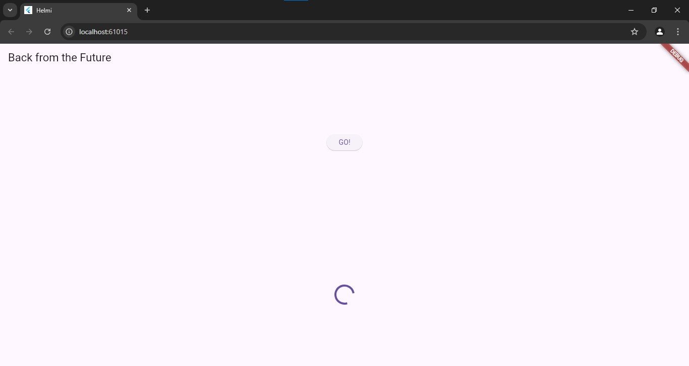
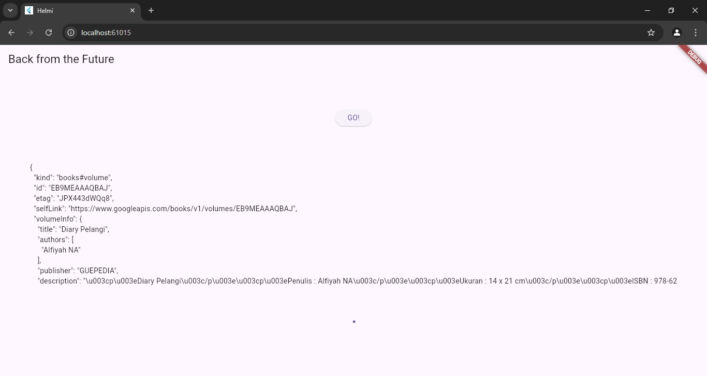

# books

# Nama: Helmi izzuddin
# NIM: 2109
# Kelas: 2D TRPL

# soal 1

# soal 2
# soal 3

# => substring(0, 450) digunakan untuk mengambil 450 karakter pertama dari value.body.toString(). Jadi, jika value.body adalah sebuah objek yang berisi data dalam bentuk string, maka hanya 450 karakter awal dari data tersebut yang akan diambil dan disimpan ke dalam variabel result
# => jika terjadi error saat menjalankan fungsi getData(), maka variabel result akan diisi dengan pesan "An error occurred"
